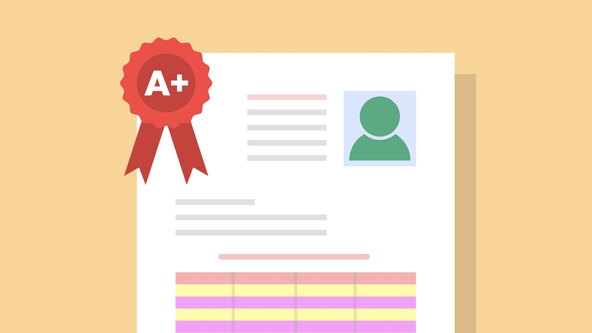

# Project Description

How can students improve their exam performance? In this intermediate SQL querying project, we will analyze a database containing comprehensive data on various factors influencing student success, such as study habits, sleep patterns, parental involvement, and access to resources.

Through SQL queries, we will investigate which factors have the greatest impact on high exam scores, explore whether students who participate in more extracurricular activities perform better, and ascertain the influence of sleep on academic achievement. By the end, we will have a data-driven understanding of the drivers of student success, enabling us to make informed decisions for academic improvement.

# student-performance-project

 

In today's fast-paced and competitive educational environment, understanding the factors that influence student success is more important than ever. Just like the transport system in a bustling city like London must adapt to serve its residents, schools and educators must adapt to meet the needs of students. In this project, we will take a deep dive into a dataset containing rich details about various aspects of student life, such as hours studied, sleep patterns, attendance, and more, to uncover what truly impacts exam performance.

The dataset we'll be working with includes a wide range of factors influencing student performance. By analyzing this data, we'll be able to identify key drivers of success and provide insights that could help students, teachers, and policymakers make informed decisions. The table we'll use for this project is called `student_performance` and includes the following data:

| Column                   | Definition                                                      | Data type             |
|--------------------------|-----------------------------------------------------------------|-----------------------|
| `attendance`              | Percentage of classes attended                                  |     `float`               |
| `extracurricular_activities` | Participation in extracurricular activities                   |     `varchar` (Yes, No)    |
| `sleep_hours`             | Average number of hours of sleep per night                      |     `float`               |
| `tutoring_sessions`       | Number of tutoring sessions attended per month                  |     `integer`             |
| `teacher_quality`         | Quality of the teachers                                         |     `varchar` (Low, Medium, High) |
| `exam_score`              | Final exam score                                                |     `float`               |

The following three questions are answered in this project:
1. What are average exam scores for students that are studying for more than 10 hours and also taking part in extra curricular activities?
2. When categorized the students in 4 groups depending on the number of study hours, what is the average exam score for each group?
3. Rank the students according to their exam scores. Students that got same score must be awarded same rank and the next rank must not be skipped.
